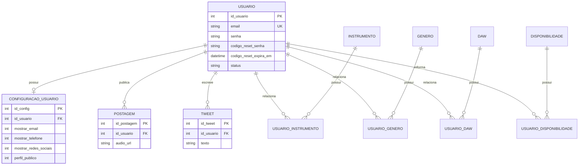

# Backstage Cena

Plataforma web para conectar músicos, com front-end estático, API Express, Prisma/SQLite, autenticação JWT, validação com Zod, upload de áudio e testes automatizados.

## Visão geral

O Backstage Cena é uma aplicação web desenvolvida para conectar músicos, produtores e artistas independentes. A plataforma permite:

- cadastro e login de usuários;
- criação e atualização de perfil;
- publicação de postagens de áudio;
- publicação de tweets;
- pesquisa de perfis e colaboração;
- envio de e-mails de boas-vindas e redefinição de senha.

A aplicação combina front-end estático em HTML/CSS/JavaScript com API REST em Node.js + Express e persistência com Prisma + SQLite.

## Stack principal

- Front-end: HTML, CSS, JavaScript ESM
- Back-end: Node.js, TypeScript, Express, Morgan
- Banco: Prisma + SQLite
- Autenticação: JWT + Argon2
- Validação: Zod
- Upload: Multer
- E-mail: Nodemailer
- Testes: Vitest, Supertest, Playwright, JSDOM

## Requisitos

- Node.js 20+
- npm
- SQLite local
- Um arquivo `.env` com variáveis de ambiente

## Configuração inicial

```bash
npm install
cp .env.example .env
npm run setup
npm run dev
```

O servidor será iniciado em:

```text
http://localhost:3000
```

## Variáveis de ambiente

Use o arquivo `.env.example` como referência. As variáveis essenciais são:

```env
DATABASE_URL="file:./dev.db"
JWT_SECRET="seu_segredo_aqui"
RESET_CODE_SECRET="seu_segredo_opcional"
NODE_ENV=development
EMAIL_HOST=
EMAIL_PORT=587
EMAIL_SECURE=false
EMAIL_USER=
EMAIL_PASS=
EMAIL_FROM=noreply@backstagecena.com
APP_PROFILE_URL=http://localhost:3000/pages/perfil.html
```

Observações:

- `.env` não deve ser versionado;
- em desenvolvimento, se `EMAIL_HOST` estiver vazio, o sistema usa uma conta Ethereal de testes e imprime no terminal a URL da pré-visualização do e-mail;
- `APP_PROFILE_URL` adiciona o botão de “Completar meu perfil” no e-mail de boas-vindas;
- os valores reais das credenciais de e-mail devem ficar somente no `.env` local.
- `RESET_CODE_SECRET` é opcional; sem ele, o HMAC do código usa `JWT_SECRET`.

## Scripts disponíveis

```bash
npm run dev
npm start
npm run build
npm test
npm run front:test
npm run e2e
npm run coverage
npm run prisma:generate
npm run prisma:push
npm run seed
npm run setup
npm run reset
```

## Banco de dados e Prisma

O projeto usa Prisma para modelagem, migrações e acesso ao banco:

```bash
npm run prisma:generate
npx prisma migrate deploy
npm run seed
```

Estrutura relevante:

- `prisma/schema.prisma` — modelo do banco
- `prisma/migrations/` — migrations versionadas
- `prisma/seed.ts` — dados iniciais para desenvolvimento
- `src/models/` — camada de acesso ao banco via Prisma Client

## Validação, autenticação e e-mail

A aplicação aplica regras de validação antes dos controllers usando Zod:

- `src/schema/usuario.schema.ts`
- `src/schema/conteudo.schema.ts`
- `src/middlewares/validate.ts`

A autenticação usa JWT e proteção de rotas por middleware:

- `src/middlewares/auth.ts`
- `src/controllers/UsuarioController.ts`

O envio de e-mail foi centralizado em serviço isolado:

- `src/config/mail.ts`
- `src/services/EmailService.ts`

O cadastro envia e-mail de boas-vindas após criação bem-sucedida. Falha no SMTP não bloqueia a criação e apenas registra o erro no log.

Os limites de login e redefinição usam armazenamento em memória por padrão. Em implantações com mais de uma instância, configure um store compartilhado (por exemplo, Redis com `rate-limit-redis`).

## Testes

Os testes estão organizados por escala e responsabilidade:

- `npm test`: testes unitários e de API
- `npm run front:test`: testes de front-end com JSDOM
- `npm run e2e`: testes end-to-end com Playwright
- `npm run coverage`: relatório de cobertura de código

## Estrutura do projeto

```text
.
├── prisma/
│   ├── migrations/
│   ├── schema.prisma
│   └── seed.ts
├── public/
│   ├── css/
│   ├── js/
│   ├── pages/
│   └── uploads/
├── src/
│   ├── config/
│   ├── controllers/
│   ├── database/
│   ├── errors/
│   ├── middlewares/
│   ├── models/
│   ├── routes/
│   ├── schema/
│   ├── services/
│   └── utils/
├── tests/
├── .env.example
├── .gitignore
├── package.json
├── tsconfig.json
├── vitest.config.ts
├── playwright.config.ts
├── request.http
├── README.md
└── LICENSE
```

## Diagrama ERD



## Observações importantes

- O projeto usa `localStorage` para armazenar token do usuário no front-end; isso é adequado para a entrega didática, mas em produção uma opção mais segura seria usar cookies HttpOnly.
- A validação do front-end é de experiência/UX; a proteção real está no back-end.
- As regras de negócio e de integridade permanecem no servidor, no schema e no banco.

## Autor

Desenvolvido por Arthur Alcântara e equipe do projeto Backstage Cena.
